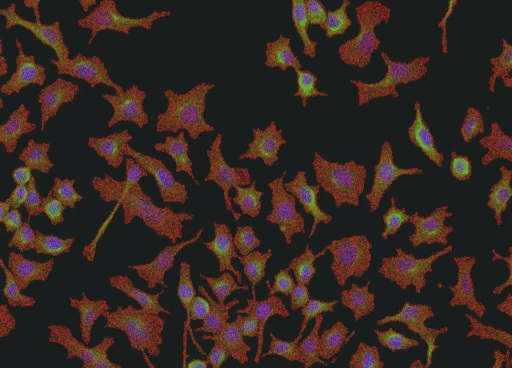

# Diffusion Splitting for Instance Segmentation
<p align="center">
  
</p>

Code for paper [Spontaneous breaking of symmetry in overlapping cell instance segmentation using diffusion models](https://academic.oup.com/biomethods/advance-article/doi/10.1093/biomethods/bpae084/7888887).

### Installation
```
pip install -r requirements.txt
pip install https://github.com/zsef123/Connected_components_PyTorch/archive/refs/heads/main.zip
```

### Dataset
Overlapping dataset can be downloaded at
[github.com/juliusbierk/cellpose-overlap](https://github.com/juliusbierk/cellpose-overlap).

### Training
```python
python split.py --data data/overlapdataset --model overlapdataset --train-all
```

download pretrained:
```bash
mkdir models
mkdir models/overlapdataset
cd models/overlapdataset
wget https://sid.erda.dk/share_redirect/AvuJczAyUI -O overlap_trained.zip
unzip overlap_trained.zip
```

### Evaluation
```python
python split.py --data data/overlapdataset --model overlapdataset --eval
```
